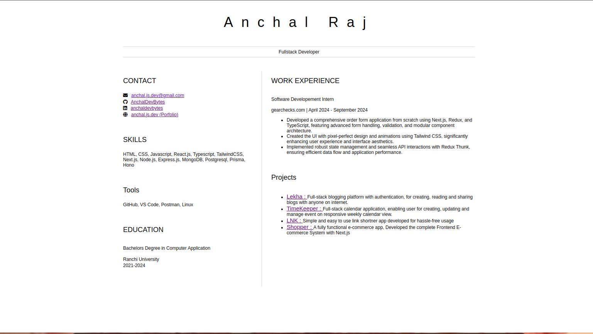

# Anchal's Resume

Welcome to my online resume website! This showcases my skills, experience, projects, and social media/portfolio links in a clean and professional format.

---

## Features
- **Contact**: Direct links to my social media profiles (LinkedIn, GitHub, etc.) and portfolio.
- **Skills**: A section displaying my technical and soft skills.
- **Tools**: A list of tools and technologies I frequently use (e.g., VS Code, Git, Postman).
- **Education**: Information about my academic background.
- **Experience**: Details about my work experience and notable achievements.
- **Projects**: A showcase of my personal and professional projects, with links to their live demos.

---

## Technologies Used
- **HTML**: For structuring the content.
- **CSS**: For styling and layout.
- **Font Awesome**: For icons (e.g., social media, portfolio).

---

## Deployed on Github page :- [click here](https://anchaldevbytes.github.io/html-resume/)
